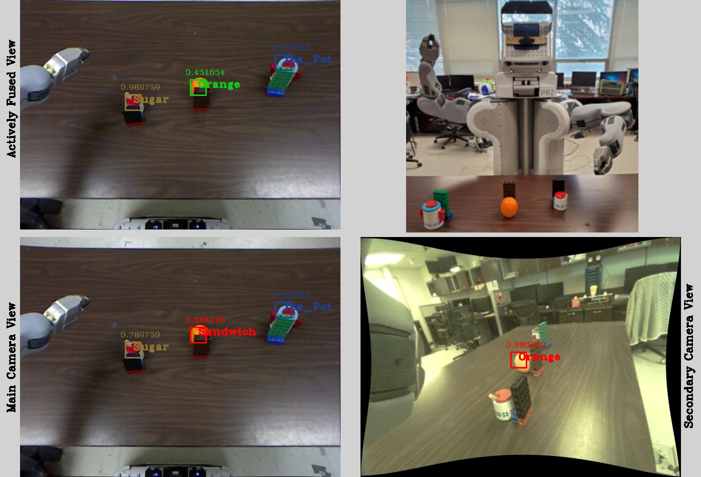

# Active Object Detection on the PR2 Robot
This is an active vision system on a PR2 humanoid robot to detect objects. Object detection can face issues in real-world tasks if the object is partially occluded or the object viewpoint is not good enough for the vision system. This project aims at resolving those situations by dynamically identifying them and by incorporating a second camera to improve the detection performance.

## Description
The detailed descriptions can be found in our published papers: Computers ([pdf](docs/2019-Computers.pdf) and [MDPI](https://doi.org/10.3390/computers8040071)), ISVC ([pdf](docs/ISVC_Hoseini.pdf) or [Springer Link](https://doi.org/10.1007/978-3-030-33723-0_15)), CogSIMA ([pdf](docs/2018-CogSIMA.pdf) or [IEEE Xplore](https://doi.org/10.1109/COGSIMA.2018.8423982)), and ICVISP ([pdf](docs/2018-ICVISP.pdf) or [ACM DL](https://doi.org/10.1145/3271553.3271564)).

The robotic vision system works on the PR2's ROS robotic platform. It uses two cameras: a Kinect 3D camera installed on the robot's head and an RGB camera in the robot's forearm. It first tries to detect objects viewed by the head camera and measures the confidence of the detections. If there is any uncertain detection, the vision system plans the movement of the forearm frame and with that the secondary camera to get another viewpoint of the object with the uncertain detection. After moving the secondary RGB camera close to the object, another round of object detection is done, this time in the viewpoint of the secondary camera. Later, the detections of the two camera views are matched and fused. The flowchart of the general steps can be seen below:
<p align="center">
  
</p>

The matching is performed by trasforming object locations from one camera frame to the other one and searching for closer objects in the original frame with the transformed ones. The fusion of detections happens through either Bayesian or Dempster-Shafer fusion. Here is an example situation with objects being partially occluded. 
<p align="center">
  
</p>

The red bounding box at bottom left shows an uncertain (and incorrect) detection. After the forearm movement, the detections in the secondary camera view are shown at bottom right. The top left frame shows the fusion result with corrected detections.

## The Code
The code is written in C++ and Python. It is dependent on ROS, MoveIt, OpenCV, Scikit-learn, Boost.Python, and Gazebo. The vision system can work with both physical PR2 and the one in Gazebo simulation. The source code is placed under the *SourceCode* directory. There are some scripts, however, for running the code easier. They are:
* Build.sh: To compile the code
* Run.sh: To run the vision system
* TrainVision.sh: To train the classifiers for object detection
* PrepareRosService.sh: Setup the ros environment variables
* RealPR2Setup.sh: Setup the environement variables to get connected to the PR2 robot
* Gazebo.sh: Run the Gazebo simulation environment with the preset test setup
* Moveit.sh: To run the MoveIt service to make it possible to move the robot's parts

There may some changes to the above files be needed, such as changing IP addresses, etc., to make the environment variables correct and connections to the services working. The current repository should be cloned under the source forlder of a ROS package.

# Citation
To refer to this work you may cite our papers: [Computers](https://doi.org/10.3390/computers8040071), [International Symposium on Visual Computing](https://doi.org/10.1007/978-3-030-33723-0_15), [IEEE Conference on Cognitive and Computational Aspects of Situation Management](https://doi.org/10.1109/COGSIMA.2018.8423982), or [International Conference on Vision, Image and Signal Processing](https://doi.org/10.1145/3271553.3271564).
```
@article{hoseini2019active,
  title={Active Eye-in-Hand Data Management to Improve the Robotic Object Detection Performance},
  author={Hoseini, Pourya and Blankenburg, Janelle and Nicolescu, Mircea and Nicolescu, Monica and Feil-Seifer, David},
  journal={Computers},
  volume={8},
  number={4},
  pages={71},
  year={2019},
  publisher={Multidisciplinary Digital Publishing Institute}
}
```
```
@inproceedings{hoseini2019active,
  title={An Active Robotic Vision System with a Pair of Moving and Stationary Cameras},
  author={Hoseini A, S Pourya and Blankenburg, Janelle and Nicolescu, Mircea and Nicolescu, Monica and Feil-Seifer, David and others},
  booktitle={International Symposium on Visual Computing},
  pages={184--195},
  year={2019},
  organization={Springer}
}
```
```
@inproceedings{hoseini2018handling,
  title={Handling Ambiguous Object Recognition Situations in a Robotic Environment via Dynamic Information Fusion},
  author={Hoseini A, S Pourya and Nicolescu, Mircea and Nicolescu, Monica and others},
  booktitle={2018 IEEE Conference on Cognitive and Computational Aspects of Situation Management (CogSIMA)},
  pages={56--62},
  year={2018},
  organization={IEEE}
}
```
```
@inproceedings{hoseini2018active,
  title={Active Object Detection Through Dynamic Incorporation of Dempster-Shafer Fusion for Robotic Applications},
  author={Hoseini A, S Pourya and Nicolescu, Mircea and Nicolescu, Monica},
  booktitle={Proceedings of the 2nd International Conference on Vision, Image and Signal Processing},
  pages={1--7},
  year={2018}
}
```

# Developers
[Pourya Hoseini](https://github.com/pouryahoseini/)

# Contact
I can be reached at research@pouryahoseini.com.
